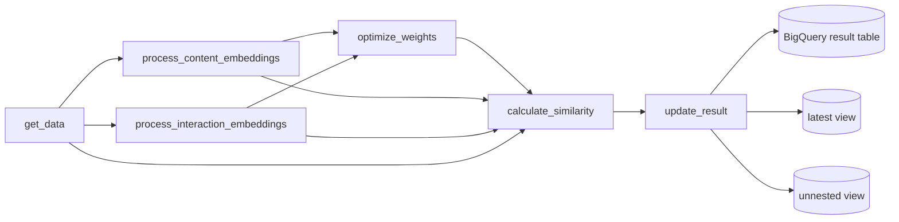

# Brand Similarity Pipeline

언어: [English](README.md) | Korean

`brand_similarity`는 이커머스 추천을 위해 브랜드 간 유사도를 계산하는 Vertex AI / Kubeflow Pipelines 워크플로입니다. 브랜드 프로필 기반 콘텐츠 신호와 사용자 행동 기반 인터랙션 신호를 결합하고, 필요하면 Vertex AI Vizier로 피처 가중치를 최적화한 뒤 최종 Top-N 추천 결과를 BigQuery에 적재합니다.

## 파이프라인 흐름



## 컴포넌트

| 컴포넌트 | 파일 | 역할 |
|----------|------|------|
| `get_data` | `components/data_processor.py` | BigQuery에서 브랜드 프로필을 조회하고 category, demographic, ownership, fashion, new-brand 필드를 정규화한 뒤 parquet dataset으로 저장합니다. |
| `process_content_embeddings` | `components/contents_processor.py` | description, price percentile, demographic ratio, category-group 피처로 콘텐츠 유사도 행렬을 생성합니다. |
| `process_interaction_embeddings` | `components/interaction_processor.py` | search click, co-view, co-purchase, shared cart, shared purchase 기반 인터랙션 유사도 행렬을 생성합니다. |
| `optimize_weights` | `components/weights_optimizer.py` | Vertex AI Vizier로 content, interaction, global hybrid 가중치를 NDCG@K 기준으로 최적화합니다. 최적화를 건너뛰거나 검증 데이터가 없으면 중립 가중치를 사용합니다. |
| `calculate_similarity` | `components/similarity_calculator.py` | 가중 content/interaction 점수를 결합하고 HYBRID 및 CONTENT 추천 결과를 Top-N으로 생성합니다. |
| `update_result` | `components/result_uploader.py` | 결과 parquet을 BigQuery에 적재하고 latest 및 unnested view를 갱신합니다. |

## 피처 방법

### 콘텐츠 피처

| 피처 | 방법 | 설명 |
|------|------|------|
| `description` | SentenceTransformer embedding + cosine similarity | `intfloat/multilingual-e5-base`로 브랜드 설명의 의미적 유사도를 비교합니다. |
| `price_pct` | `1 - absolute difference` | 정규화된 가격 percentile 값을 비교합니다. |
| `demo_ratio` | `1 - Jensen-Shannon divergence` | 인구통계 분포를 비교하고 demographic 값이 없는 행은 마스킹합니다. |
| `category_group` | FastText 평균 term vector + cosine similarity | 사용 가능한 카테고리 term으로 로컬 FastText 모델을 학습해 비교합니다. |

### 인터랙션 피처

| 피처 | 이벤트 | 단위 | 정규화 |
|------|--------|------|--------|
| `search_to_click` | `click_search_result` | session | `log1p` + max scaling |
| `co_view` | `view_product` | session / pair count | `log1p` + max scaling |
| `co_purchase` | `purchase` | order | normalized PMI |
| `shared_carts` | `add_to_cart` | user | Jaccard index |
| `shared_purchases` | `purchase` | user | Jaccard index |

인터랙션 행렬은 sparse brand-brand matrix입니다. 각 피처는 정규화된 뒤 elbow method로 선택한 component 수로 `TruncatedSVD`를 적용하고 cosine similarity로 변환됩니다.

## 파라미터

아래 기본값은 `pipeline.py` 기준입니다.

| 파라미터 | 기본값 | 설명 |
|----------|--------|------|
| `dataset` | `sample` | 결과 테이블과 검증 데이터가 위치한 BigQuery dataset입니다. |
| `reference_dt` | `20260101` | `YYYYMMDD` 형식의 기준일입니다. |
| `max_trials` | `5` | Vizier 최적화 trial 수입니다. `0`이면 Vizier를 건너뛰고 중립 가중치를 사용합니다. |
| `top_n` | `100` | 브랜드별, 유사도 타입별로 반환할 유사 브랜드 수입니다. |
| `period` | `365` | 브랜드 프로필과 행동 데이터 조회 기간입니다. |

## 데이터 소스

파이프라인은 `project-demo-498806.sample`의 demo table을 조회합니다.

| 테이블 | 사용처 |
|--------|--------|
| `demo_brand_profiles` | 브랜드 master/profile 데이터 |
| `demo_brand_interactions` | 검색, 조회, 구매, 장바구니 이벤트 |
| `demo_brand_pair_counts` | 사전 집계된 co-view pair count |
| `demo_brand_similarity_validation` | Vizier 검증 ranking |

## 출력

`update_result`는 BigQuery에 다음 결과를 생성합니다.

| 출력 | 설명 |
|------|------|
| `{dataset}.brand_similarity` | 메인 결과 테이블입니다. `period == 365`이면 `{dataset}.brand_similarity_1y`를 사용합니다. |
| `{table}_latest` | 현재 `reference_dt` 결과 view입니다. |
| `{table}_unnested` | 유사 브랜드 ranking을 펼친 view입니다. |

각 결과 row에는 브랜드 메타데이터, 직렬화된 feature payload, `similarity_type`(`HYBRID` 또는 `CONTENT`), 순위화된 유사 브랜드, 점수 breakdown이 포함됩니다.

## 빌드

파이프라인은 다음 명령으로 컴파일합니다.

```bash
python brand_similarity/pipeline.py
```

컴포넌트는 다음 container image를 사용합니다.

```text
us-west1-docker.pkg.dev/project-demo-498806/docker/brand-similarity:latest
```
