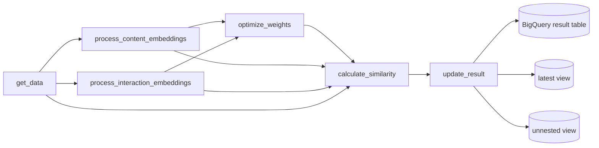

# Brand Similarity Pipeline

Languages: English | [Korean](README.ko.md)

`brand_similarity` is a Vertex AI / Kubeflow Pipelines workflow that calculates similar brands for ecommerce recommendations. It combines content-based brand profile signals with interaction-based behavior signals, optionally optimizes feature weights with Vertex AI Vizier, and uploads the final top-N recommendations to BigQuery.

## Pipeline Flow



## Components

| Component | File | Purpose |
|-----------|------|---------|
| `get_data` | `components/data_processor.py` | Loads brand profiles from BigQuery, normalizes category, demographic, ownership, fashion, and new-brand fields, then writes a parquet dataset. |
| `process_content_embeddings` | `components/contents_processor.py` | Builds content similarity matrices from description, price percentile, demographic ratio, and category-group features. |
| `process_interaction_embeddings` | `components/interaction_processor.py` | Builds interaction similarity matrices from search clicks, co-views, co-purchases, shared carts, and shared purchases. |
| `optimize_weights` | `components/weights_optimizer.py` | Uses Vertex AI Vizier to optimize content, interaction, and global hybrid weights with NDCG@K. Falls back to neutral weights when optimization is skipped or validation data is empty. |
| `calculate_similarity` | `components/similarity_calculator.py` | Combines weighted content and interaction scores, creates HYBRID and CONTENT recommendation sets, and writes top-N results. |
| `update_result` | `components/result_uploader.py` | Loads the result parquet into BigQuery and refreshes latest and unnested views. |

## Feature Methods

### Content Features

| Feature | Method | Notes |
|---------|--------|-------|
| `description` | SentenceTransformer embeddings + cosine similarity | Uses `intfloat/multilingual-e5-base` to compare brand descriptions semantically. |
| `price_pct` | `1 - absolute difference` | Compares normalized price percentile values. |
| `demo_ratio` | `1 - Jensen-Shannon divergence` | Compares demographic distributions and masks missing demographic rows. |
| `category_group` | FastText averaged term vectors + cosine similarity | Trains a local FastText model from the available category terms. |

### Interaction Features

| Feature | Event | Unit | Normalization |
|---------|-------|------|---------------|
| `search_to_click` | `click_search_result` | session | `log1p` + max scaling |
| `co_view` | `view_product` | session / pair count | `log1p` + max scaling |
| `co_purchase` | `purchase` | order | normalized PMI |
| `shared_carts` | `add_to_cart` | user | Jaccard index |
| `shared_purchases` | `purchase` | user | Jaccard index |

Interaction matrices are sparse brand-brand matrices. Each feature is normalized, reduced with `TruncatedSVD` using an elbow-method component count, and converted to cosine similarity.

## Parameters

These defaults come from `pipeline.py`.

| Parameter | Default | Description |
|-----------|---------|-------------|
| `dataset` | `sample` | BigQuery dataset for result tables and validation data. |
| `reference_dt` | `20260101` | Reference date in `YYYYMMDD` format. |
| `max_trials` | `5` | Number of Vizier optimization trials. Use `0` to skip Vizier and use neutral weights. |
| `top_n` | `100` | Number of similar brands returned for each brand and similarity type. |
| `period` | `365` | Lookback window in days for brand profile and behavior data. |

## Data Sources

The pipeline reads demo tables in `project-demo-498806.sample`:

| Table | Used By |
|-------|---------|
| `demo_brand_profiles` | Brand master/profile data |
| `demo_brand_interactions` | Search, view, purchase, and cart events |
| `demo_brand_pair_counts` | Pre-aggregated co-view pair counts |
| `demo_brand_similarity_validation` | Vizier validation rankings |

## Output

`update_result` writes to BigQuery:

| Output | Description |
|--------|-------------|
| `{dataset}.brand_similarity` | Main result table. Uses `{dataset}.brand_similarity_1y` when `period == 365`. |
| `{table}_latest` | View for the current `reference_dt`. |
| `{table}_unnested` | Flattened view of similar-brand rankings. |

Each result row includes brand metadata, serialized feature payloads, `similarity_type` (`HYBRID` or `CONTENT`), ranked similar brands, and score breakdowns.

## Build

The pipeline is compiled with:

```bash
python brand_similarity/pipeline.py
```

Components use the container image:

```text
us-west1-docker.pkg.dev/project-demo-498806/docker/brand-similarity:latest
```
